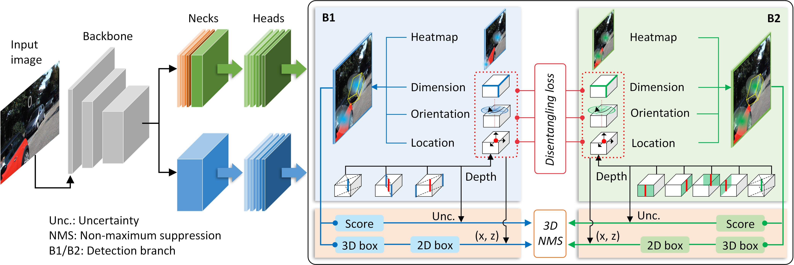

# AlignBC
 Aligning Binary Centers for Single-stage Monocular 3D Object Detection. This repository include the core codes of our method and some demos of monocular object detection based on [KITTI dataset](https://www.cvlibs.net/datasets/kitti/index.php).
 
 Here are two videos for object detection for moving objects (Cars). More can be found [here](https://github.com/fyancy/AlignBC/tree/main/abc_imgs/gif).
 - Detection for close Cars on narrow roads

 - Detection for close Cars on wide roads

## Abstract

Precisely perceiving the environment through a 3D perspective is essential and challenging for autonomous navigation and driving. Existing techniques rely on depth from LiDAR data or disparity in stereo vision to solve the poorly presented problem of detecting far-off and occluded objects. This increases structure complexity and computation burden, especially for single-stage systems. We argue that existing well-established detectors have the intrinsic potential to detect full-scene objects, but the extrinsic capabilities are limited by the structure form and optimization. Hence, we propose a double-branch single-stage monocular 3D object detection framework that aligns binary centers of object. Structurally, we construct two symmetrical and independent detectors, respectively using different prediction manners for 3D box parameters. Functionally, two detection heads have different sensitivities for the same object due to disentangling alignment. During the training, the detection heads were trained separately to obtain specific ability and aligned to promote the convergence. At inference, predictions of two branches are filtered via depth-aware non-maximal suppression (NMS) to acquire comprehensive detection results. Extensive experiments demonstrate that the proposed method achieves the state-of-the-art performance in monocular 3D detection on the KITTI-3D benchmark.

## Proposed method
### Structure

We provide a scheme to improve the full-scene detection capability of a single-stage monocular model. The method flow is shown in Figure. A single RGB image is input to the common backbone, then two detection branches independently regress the 3D box parameters from the 2D features, and finally the comprehensive detection results are output through post-processing. Almost all anchor-free methods take a well-designed detection head as the key to improve the detection ability. To improve the diversity of detection results, we adopt different prediction ways for key points, directions and locations in the two branches. Specifically, for heatmap prediction, 2D center and 3D projected center are respectively used for truncated objects at the image edge respectively; for depth estimation, we use geometric distance decomposition for opposite and adjacent sides of 3D box; for orientation regression, we use different numbers of discrete bins. Furthermore, to align the two branches, we design a hinged disentangling loss for training and extended 3D non-maximal suppression (NMS) at inference.

Fig. Training and testing pipeline of the proposed method. 

### Training loss

We consider the 3D loss, 2D loss and alignment loss of the proposed model to minimize, as follows
$$L_\text{ABC}=\sum_{i=1}^{2}\left(L_{i,\text{kpt}}\left ( I;\phi_f,\phi_i \right ) +L_{i,\text{3D}}\left ( I;\phi_f,\phi_i \right )+L_{i,\text{2D}}\left ( I;\phi_f,\phi_i \right )\right)+L_\text{dis}\left ( \phi_f(I);\phi_1, \phi_2 \right )\text{,}$$
where $L_{i,\Box}$ denotes the loss item for the $i^\text{th}$ branch, and $\phi_f$ the parameterized backbone. For both branches, the keypoint classification loss $L_\text{kpt}$ is the penalty-reduced focal loss \cite{law2018cornernet}, $L_\text{3D}$ is the sum loss for 3D box components including dimensions ($L_\text{dim}$), location ($L_\text{loc}$) and orientation ($L_\text{ori}$), where $L_\text{dim}$ is the L1 loss for dimension regression, the orientation estimation error $L_\text{ori}$ is the MultiBin loss combined bin classification with angle regression, $L_\text{loc}$ contains the L1 loss for center offsets and the uncertainty-aware regression loss for object depth. And the disentangled box-matching loss $L_\text{dis}$, in which only the deteciton branches are updated iteratively.

### Experimental setup

The proposed method is validated on the KITTI-3D dataset, the most widely used autonomous driving benchmark. The dataset contains 7481 training images and 7518 test images, including object categories such as cars, pedestrians and bicycles. The camera calibration information of all images is publicly available, and the image annotations of training images are also public. Therefore, we redivide the training set using two split methods $val_1$ ($N_\text{train}=3712,N_\text{val}=3769$) and $val_2$ ($N_\text{train}=3682,N_\text{val}=3799$) for discussions, following 3DOP and SubCNN, respectively. In our monocular experiments, the images from left camera are used and the Car category is focused.

 

The average precision (AP) of 3D bounding box ($\text{AP}_\text{3D}$) and average localization precision on BEV ($\text{AP}_\text{BEV}$) are used for evaluation metrics in all experiments. Considering KITTI dataset has assessed the detection difficulty of each object, we give the AP results under three difficulty classes (easy, moderate and hard). Earlier methods (prior to 2019) evaluated the model using $\text{AP}|\text{R}_{11}$, whereas more recent methods used the more reasonable $\text{AP}|\text{R}_{40}$. For fair comparison, we report both 11-point and 40-point AP results of our method when compared with other methods. In discussion, we only give the $\text{AP}|\text{R}_{40}$ results. We mainly focus on the detection performance on Car category and use $(0.7, 0.7, 0.7)$ as the default IoU thresholds for three difficulty levels in experiments.

## Performance

We visualize the qualitative results on KITTI-3D dataset. The figure below shows the single-branch and double-branch detection results of the proposed method on $val_1$ set, where the three columns display the detection results generated from $b_1$ and $b_2$, and the aligned results, respectively.} We show the scenarios with truncated objects at the $1^\text{st}$ row, distant objects at the $2^\text{nd}$ row, occluded objects at the $1^\text{st}$ row. In addition, the post-processing can also filter inferior detections with low confidence (e.g. the $3^\text{rd}$ and $4^\text{th}$ row). This demonstrates that our method could significantly enhance the low-quality detection results through double branch structure.

Fig. Qualitative results of the proposed method on KITTI-3D $val_1$ set. From left to right are the 3D detection result from $b_1$, $b_2$, and alignment. On the far right is a BEV.  

## Citations
